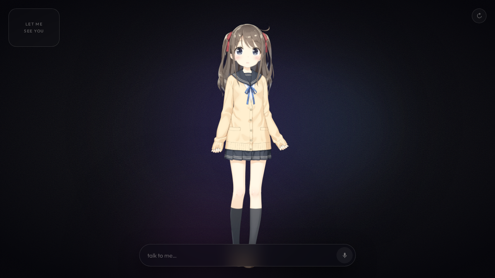

# Disha



An interactive AI companion application leveraging the Gemini Multimodal Live API to provide seamless audio-visual interactions. The application processes voice, text, and environmental context (such as facial expressions) to enable natural, conversational experiences.

## Overview

Disha is designed to demonstrate real-time interaction capabilities using Google's Gen AI ecosystem. It integrates:
* **Gemini Multimodal Live API**: For real-time, low-latency conversational AI capabilities via WebSockets.
* **Audio Processing**: High-quality audio recording and playback for voice interaction.
* **Contextual Awareness**: Real-time emotion detection and facial expression analysis via device camera integration.
* **Animated Avatar**: A responsive interface built on WebGL/PixiJS.

## Prerequisites

Before running the application, ensure you have the following installed:

* [Node.js](https://nodejs.org/) (v18 or higher recommended)
* A valid Gemini API Key

## Setup & Installation

1. **Clone the repository**
   ```bash
   git clone <your-repository-url>
   cd disha
   ```

2. **Install dependencies**
   ```bash
   npm install
   ```

3. **Configure Environment Variables**
   Create a `.env` file in the root directory based on the provided example:
   ```bash
   cp .env.example .env
   ```
   Open `.env` and add your Gemini API key:
   ```env
   GEMINI_API_KEY=your_gemini_api_key_here
   ```

## Running the Application

### Development Server
To start the Vite development server:
```bash
npm run dev
```
The application will be accessible at `http://localhost:8777` (or your configured Vite port).

### Production Build
To build for production and run the application via the included Node server:
```bash
npm run build
npm run start
```
The production server runs by default on `http://localhost:8777`.

## Architecture & Technology Stack

* **Frontend**: React (v19) powered by Vite.
* **AI Integration**: `@google/genai` (v2.14+) for managing interactions with the Gemini models.
* **Visuals & Rendering**: PixiJS and related WebGL libraries for avatar rendering and animations.
* **Computer Vision**: `face-api.js` for on-device facial expression analysis.

## License

*(Add your license information here, e.g., Apache 2.0 or MIT)*
